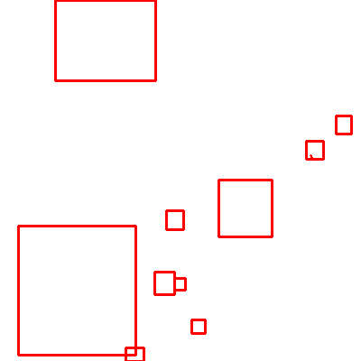

# Crater_Detection

## Project Overview

**Project Name:** Crater_Detection  
**Author:** Pirate-Emperor

## Description

Crater_Detection is a specialized repository developed by Pirate-Emperor that focuses on identifying and outlining impact craters on lunar surfaces. This project combines the outputs of various lunar models, including Lunar_ISR, Crater_Detection itself, Height_Map, DTM_3D, Slope, Shadow, and Hazard_Map, to create detailed crater maps. Accurate crater detection is crucial for lunar research, exploration, and mission planning.

## Models Integration

Crater_Detection integrates the following models to derive crater maps:

1. **Lunar_ISR:** Enhances the resolution of lunar images to provide clearer details.
2. **Crater_Detection:** Identifies and outlines impact craters on the lunar surface.
3. **Height_Map:** Generates high-resolution lunar height maps for accurate topographic information.
4. **DTM_3D:** Estimates the depth information of lunar terrain from 2D images.
5. **Slope:** Provides slope maps derived from the lunar terrain.
6. **Shadow:** Generates shadow maps based on lighting conditions and lunar features.
7. **Hazard_Map:** Combines the outputs of various models to create a comprehensive hazard map.

## Screenshots
### Crater

## Features

1. **Accurate Crater Detection:** Crater_Detection uses advanced algorithms to accurately identify and outline impact craters on lunar images.

2. **Comprehensive Crater Mapping:** The project combines the outputs of various models to create comprehensive crater maps, incorporating slope, shadow, and hazard information for detailed analysis.

3. **Customizable Detection Parameters:** Researchers and users can adjust parameters to fine-tune crater detection based on specific lunar exploration scenarios.

4. **Integration Support:** Crater_Detection provides APIs and integration support for seamless incorporation into lunar exploration applications and research workflows.

## Installation

To install Crater_Detection, follow these steps:

1. Clone the repository: `git clone https://github.com/Pirate-Emperor/Crater_Detection.git`
2. Navigate to the project directory: `cd Crater_Detection`
3. Install dependencies: `pip install -r requirements.txt`
4. Ensure the necessary models (Lunar_ISR, Crater_Detection, Height_Map, DTM_3D, Slope, Shadow, Hazard_Map) are available and properly configured.
5. Run the application: `python crater_detection.py`

## Usage

1. Launch the application by executing `crater_detection.py`.
2. Input the required outputs from Lunar_ISR, Crater_Detection, Height_Map, DTM_3D, Slope, Shadow, and Hazard_Map models.
3. Adjust parameters for crater detection if needed.
4. Initiate the crater detection process.
5. Explore the derived crater maps of the lunar terrain.

## Contributing

If you're interested in contributing to Crater_Detection, please follow the guidelines in the [CONTRIBUTING.md](CONTRIBUTING.md) file.

## License

This project is licensed under the [MIT License](LICENSE).